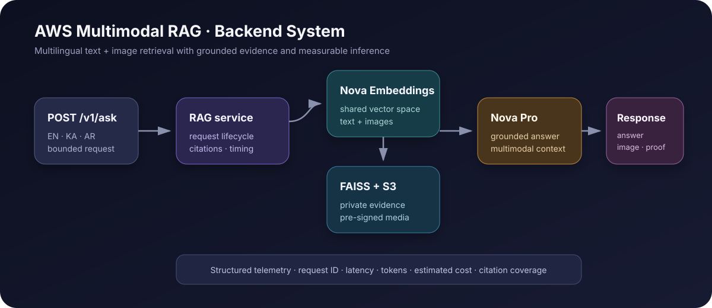

# AWS Multimodal RAG



A production-style backend for **multilingual, multimodal retrieval-augmented generation** using
Amazon Bedrock Nova, Amazon S3, and FAISS. It evolved from RAG-Knight, an experimental assistant for
exploring *The Knight in the Panther's Skin* through Georgian, English, and Arabic text plus
contextual artwork.

This repository intentionally contains **no frontend**. Its portfolio focus is the AI retrieval and
serving architecture: multimodal indexing, grounded responses, evaluation, observability, security,
and reproducible deployment.

## What makes it multimodal

Text passages and images are embedded with the same Nova Multimodal Embeddings model and stored in
one FAISS index. A question can therefore retrieve both semantically relevant text and artwork.
Nova Pro receives the retrieved passages and actual image bytes; the API returns a short-lived image
URL selected from retrieved metadata, not invented by the model.

## Portfolio evidence

- Original prototype index: **188 items** — 59 text chunks and 129 images
- Languages demonstrated: **Georgian, English, and Arabic**
- Runtime options: zero-cost deterministic demo or AWS Bedrock/S3/FAISS
- Evidence contract: answer, language, image, citations, tokens, cost estimate, and latency
- Engineering controls: tests, evaluation dataset, CI, Docker, bounded inputs, private S3 media

Read the [case study](docs/CASE_STUDY.md), [architecture decisions](docs/ARCHITECTURE.md), and
[security baseline](docs/SECURITY.md).

## Run locally without AWS

Prerequisites: Python 3.11+ and [uv](https://docs.astral.sh/uv/).

```bash
uv sync --extra dev
uv run uvicorn aws_multimodal_rag.api:app --reload
```

Open `http://127.0.0.1:8000/docs`, or call:

```bash
curl -X POST http://127.0.0.1:8000/v1/ask \
  -H 'Content-Type: application/json' \
  -d '{"query":"Who is Avtandil?"}'
```

Local mode is deterministic. It proves the API, citations, metrics, tests, and demo flow without
using credentials or incurring model cost.

## Run the quality gates

```bash
uv run ruff check .
uv run ruff format --check .
uv run pytest -q
uv run rag-eval
```

The included evaluation suite measures language accuracy, citation coverage, and expected-content
checks across the three supported languages.

## Enable AWS mode

```bash
cp .env.example .env
uv sync --extra aws --extra dev
```

Set `RAG_RUNTIME_MODE=aws`, the private S3 bucket, enabled Bedrock model IDs, and your regional token
prices. AWS credentials are loaded through boto3's standard credential chain; never place them in
the repository.

Expected S3 objects:

```text
s3://your-bucket/
├── index/amo_index.faiss
├── index/items.json
├── documents/...
└── images/...
```

`items.json` is an ordered array matching the FAISS rows. Each item follows the `RetrievedItem`
schema and references private images by `s3_key`. JSON replaces the prototype's pickle metadata to
avoid unsafe deserialization.

## API contract

`POST /v1/ask`

```json
{
  "query": "Who is Avtandil?",
  "top_k": 5
}
```

The response includes:

- grounded answer and detected language
- short-lived image URL when an image was retrieved
- structured source citations and similarity scores
- input/output tokens and configurable cost estimate
- retrieval, generation, and total latency
- unique request ID for log correlation

## Deployment pattern

Build the supplied container for ECS/Fargate, App Runner, or Lambda container images. For an
internet-facing deployment, place API Gateway or an Application Load Balancer in front and add
authentication, throttling, WAF controls, and approved request-log handling.

## Scope

This is a portfolio reference implementation. It does not include the original copyrighted/source
corpus or AWS account resources. The local fixtures are synthetic demonstrations; connect your own
authorized data and rebuild the index for AWS execution.
